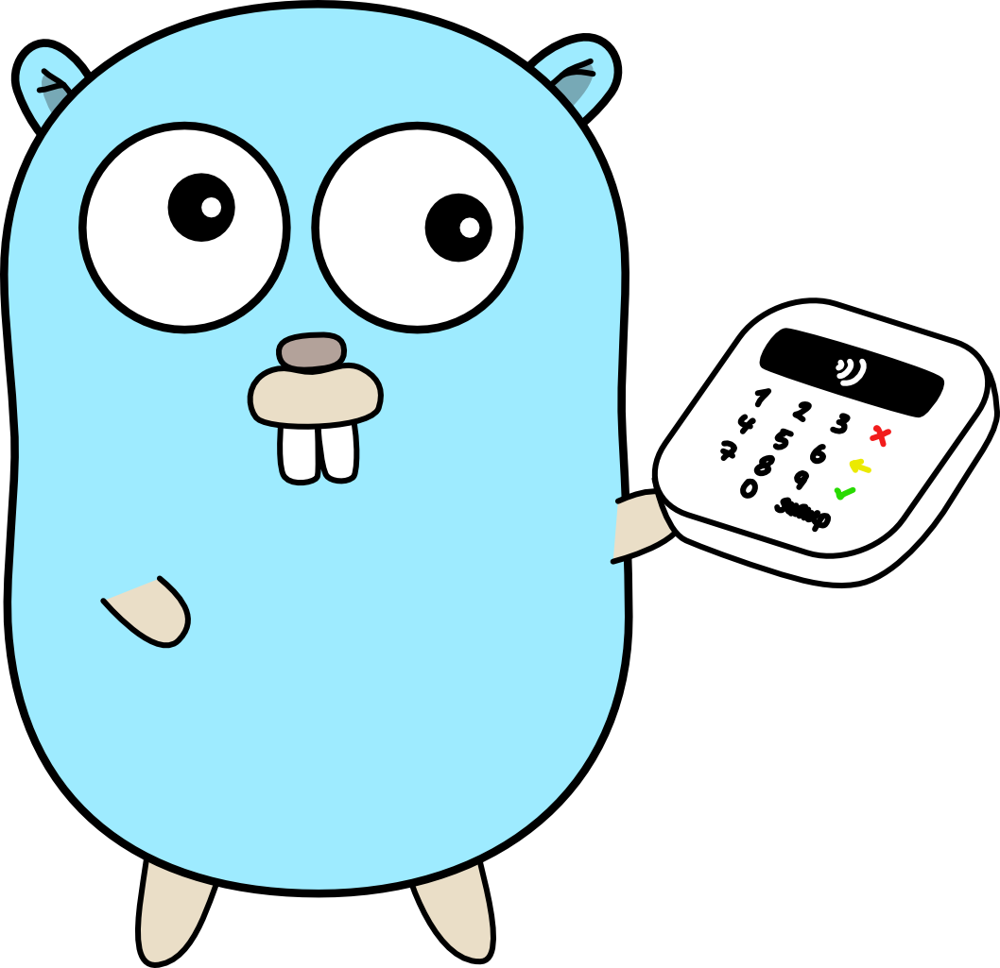

% Control structures
% Tom Arrell
% December 9, 2019

{width=180 height=180}

---

# Recap...

## Last week we covered the basics

Why do we write code the way that we do?

What really is code?

What is a compiler?

What is a type?

What is a variable?

---

# Moving on from Hello World

We covered building a program which **printed** "Hello, World!."

We also covered **reading input** from the command line, and using it as part of our program.

---

# Up next

In this lesson, we'll cover the common control structures which you will find in almost *every* programming language.

---

# What are control structures?

Control structures allow us to *"change direction"* during our program.

. . . 

They allow us to do things many times, or potentially not at all.

. . .

The basic ones we'll be covering are called **coniditionals** and **loops**.

--- 

# The **IF** statement

Also known as a conditional, this statement allows us to check whether something is *true* or *false*, and then do something.

## i.e.

> we do something depending on a **condition** being met

---

# Conditional example

```go
package main

import "fmt"

func main() {
	isSunny := true

	if isSunny {
		fmt.Println("The weather is good today!")
	} else {
		fmt.Println("The weather is bad today :(")
	}
}
```

--- 

# **IF** continued

There is a special operator which allows you to compare if two things are the same.

This is called the equality operator: `==`

## e.g.

:::incremental
- `true == false`
- `false`

- `true == true`
- `true`

- `20 == 10`
- `false`

- `"test" == "test"`
- `true`
:::

---

# Conditional example 2

```go
package main

import "fmt"

func main() {
	password := "1234"

	if password == "1234" {
		fmt.Println("Welcome, agent Gopher.")
	} else {
		fmt.Println("Sorry, wrong password.")
	}
}
```

---

# Challenge

Create a program which reads a person's name, and checks if it is "Luke Skywalker".

If it is, print: "May the force be with you."

Otherwise, greet the person normally.

Last week:

```go
...
func main() {
	scanner := bufio.NewScanner(os.Stdin)

	fmt.Print("What's your name? ")
	scanner.Scan()

	fmt.Println("Hello,", scanner.Text())
}
```

---

# Answer

```go
...

func main() {
	scanner := bufio.NewScanner(os.Stdin)
	fmt.Print("What's your name? ")
	name := scanner.Scan()

  if name == "Luke Skywalker" {
    fmt.Println("May the force be with you!")
  } else {
    fmt.Println("Hello,", name)
  }
}
```

---

# **Loops**

Loops allow us to take advantage of what machines do well; repetitive tasks.

Loops give us the ability to do the same thing many times, possibly with slight variation between each run.

---

# Loop example

Imagine we want to print out all the number from `1` to `100`, without having to manually write them out.

```go
...

func main() {
  for i := 0; i < 100; i++ {
    fmt.Println("Your number:", i)
  }
}
```

Will print out:
```
Your number: 0
Your number: 1
Your number: 2
Your number: 3
...
```

---

# Loops explained

A *traditional* loop has 3 parts, separated by semicolons.

```go
for x; y; z {
  ...
}
```

Let's talk about each part.

- **x**: where you can declare variables, run at very beginning of loop
- **y**: the condition which determines whether the loop will continue, checked before each iteration
- **z**: the statement to execute at the end of each iteration, usually adding one to the number

---

# Loops explained

Let's see that one more time...

```go
for i := 0; i < 100; i++ {
  fmt.Println("Your number:", i)
}
```

---

# Practical loops

Write a program which will print out all numbers between `1` and `n`, however, if the number is divisible by `3` print "Fizz", and if it's divisible by `5` print "Buzz".

## Tip:

The modulo operator can be used to get the remainder from a division.

- `5 % 3 == 2`
- `21 % 7 == 0`
- `100 % 40 == 20`

---

*lesson 2, fin*

If you had any trouble, now is the time to ask for help!

**Questions?**
