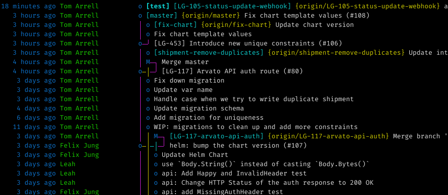

% Intro to Git
% Tom Arrell
% February 3

---

# Last week...

Last week we covered pointers and interfaces. We looked at how a pointer type stores the address where the computer can find the value.

We also looked at interfaces, and how they are special types which describe **functionality** and are useful for making your programs more flexible.

---

# Today

- Intro to Git
  - What is it?
  - Why Git?
  - How do we use it?
  - Terms
- Creating a repository
- GitHub
- Remotes
- Pushing
- Branching
- Challenge

---

# What is Git?

> TLDR: Git is a tool for tracking changes to files.

Git is all about **change tracking**. In programming, we primarily use it to track changes to our files over time. This is useful if you want to see what a piece of code looked like in the past.

Git works within set *repositories*. Each repository is separate from one another, and all file changes within the repository are tracked.

---

# What is Git?

Git is also about tracking **who** made changes. Each change is recorded with a corresponding email, so the person making changes can identify themselves.

Information about **when** changes were made is also stored. Through proper use, it is also able to track **why** changes have been made.

---

# Why Git?

Git is used by >70 percent of developers.

Git is **distributed**, meaning there is *no single source of truth*. However, we do use services which can host git repositories, like Github.

It allows us to propose changes in a structured manner. This makes development much easier when you have a large number of people contributing to the same set of files.

There are other *version control systems* around. Some alternatives to Git are, Mercurial, Apache SVN, Bazaar, Fossil etc. However these are less widely used in the industry.

---

# Terms

- **Repository**: encompasses the entire collection of files and folders associated with a project, along with each file’s revision history.
- **Commit**: an individual set of changes made to a repository at a given time, also points to the previous and next commits in the chain.
- **Branch**: a line of development within the repository, can be multiple in parallel.

---

# Installing Git

If you're using a Mac, then you already have Git installed. Otherwise, you can download it at:

> https://git-scm.com/downloads

---

# Manual

Let's have a quick look at the Git manual.

In a terminal window, type: `man git`

---

# Practical: Creating a Repository

Let's create our first repository.

:::incremental
1. Open up a terminal
2. Create a new directory `git-lesson`
3. Change into the newly created directory: `cd git-lesson`
4. Initialize the repository: `git init`
5. Check the status of the newly created repository: `git status`
:::

---

# Github

**Github** is a service which provides a place to store your Git repositories on the internet.

This means that you can have access to them from multiple computers. You don't *have* to use Github, but it is what we use here at SumUp. Alternatives exists, e.g. GitLab, Bitbucket.

They all do fundamentally the same thing, provide a remote (in the cloud) copy of the repository.

---

# Github Signup

If you haven't signed up to Github yet, you can choose to do this is you would like to follow along.

Go to

> https://github.com/signup

and you'll be prompted to create an account.

---

# Github Remote Repository

Now we're going to create a remote version of our repository in order to have the benefits of having our repository accessible from anywhere.

:::incremental
1. Go to https://github.com/new
2. Fill out your new repository's information
3. Select whether you would like the repository to be public or private
4. Click **Create repository**
5. You will now see your empty Github repository
:::

---

# Configuring your Remote

Once you have a remote repository, you want to configure your local repository to treat it as a source. To do that, we need to add it as a **remote**.

:::incremental
1. Go back to the local repository's directory in your terminal
2. Run `git remote` to see a list of the currently configured "remotes". This should be empty.
3. Run `git remote add origin [repo-url]` in order to add the new remote.
4. Run `git push --set-upstram origin master` in order to configure your local master branch to track the origin's master branch.
5. Run `git remote -v` in order to see your newly configured repository.
:::

---

# Pushing Commits

Now that you have a remote repository, each time you make a commit, you can push this commit to the remote (in this case Github), so that changes will be visible to anyone who has access to that remote repository.

You can do this using the command:

```bash
git push
```

You may be prompted for the username and password for your Github account.

---

# Branching

Branching allows you to have multiple parallel streams of work on the same repository.

> e.g. Imagine Sally was building feature *X*, and John was building feature *Y* in the same repository. To prevent their commits from clashing, they commit to separate branches. When they're both done with their respective features, they **merge** into the master branch.

The default branch in a repository goes by the name of **master**.

---

# Branching



---

# Creating a New Branch

You can create a new branch from the currently checked out branch by using the command:

```bash
git branch [name]
```

Now you can checkout into your newly created branch.

```bash
git checkout [name]
```

Now when you run `git status`, you will see that you are now checked out into your new branch.

---

# Branches Continued

Branches are isolated from one another, when you switch branches, all the files in the repository will be modified to reflect their state on that branch.

e.g. If Sally makes changes to file *X* on her branch, they won't be visible to John on his branch unless he merges Sally's changes into his branch, using `git merge [branch]`.

---

# Challenge

Create a new repository in the directory that you have stored the **previous lessons' challenges** and commit all the changes to **master**.

Once you've done that, create a new repository on Github, set this remote up within your local repository and push your changes.

**Extra**: Create a new branch and create a file called `README.md`. Write a description of your new repository in the file. Push this new branch to Github, and open a pull-request against the **master** branch.

---

*lesson 8, fin*

If you had any trouble, now is the time to ask for help!

**Questions?**
